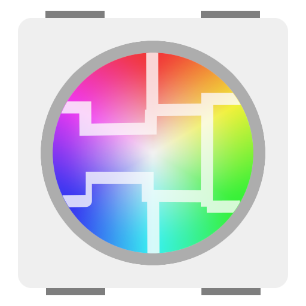
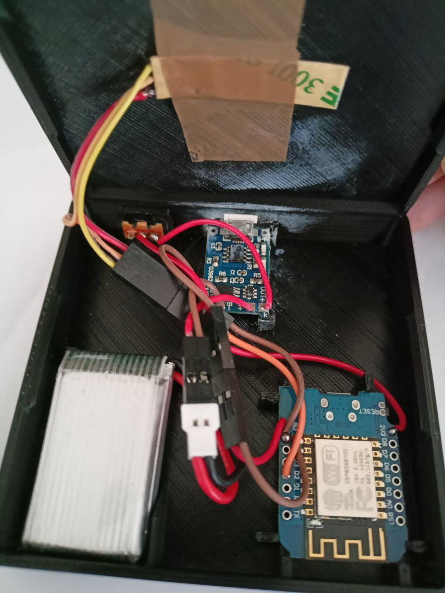
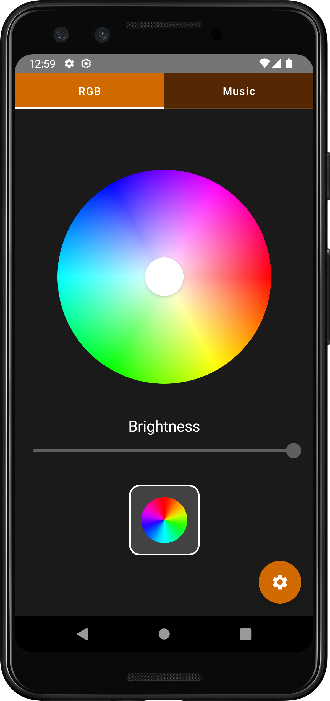
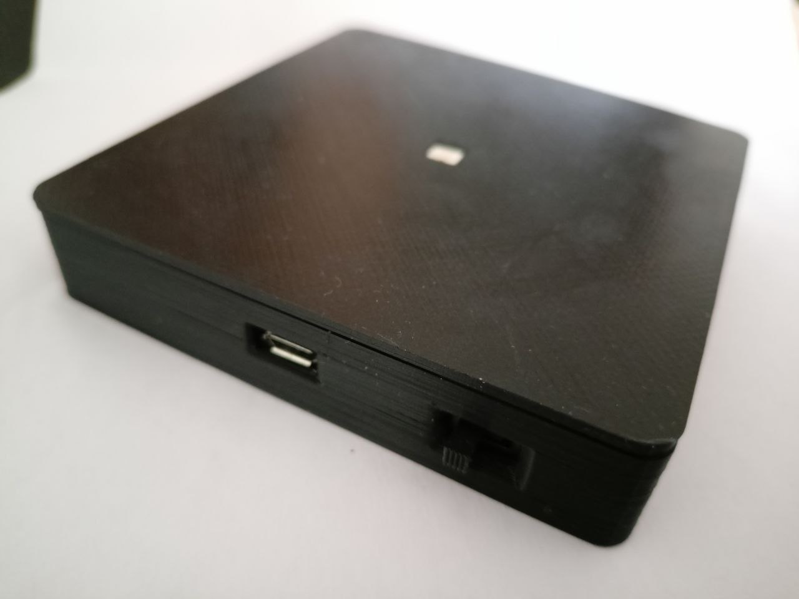

# BaseLed 
ESP8266 driven RGB LED for Bottle Lamps controlled over WiFi

# Hardware

---

* WeMos D1 Mini (ESP8266)
* WS2812b single LED Strip
* TP4056 Li-Ion Battery USB Charger
* Li-Ion Battery (3.7v, 600mAh)
* Slide Switch

# Code

---
## Arduino Sketch
* _Adafruit NeoPixel_ Library to control **WS2812b** LED
* Uses **EEPROM** to permanently store Color set by User
* Exposing **WebSocket** to control Color/Animations
* **ESPNow** Communication between all active nodes to synchronize using **Master-Slave** protocol

## Android App

* Your Android device has to be connected to the same **WiFi** as the BaseLed nodes
* When starting the App it tries to find the **active Master node** by pinging a given set of IPs (can be adjusted in the settings)
* Allows to change the displayed **Color** and start **Animations** over WebSocket connection

# 3D printed Case

---

The case for the a BaseLed node can be printed in **2 parts**:
* Case Body (/case/BaseLed_Case_Body.stl)
* Case Cover (/case/BaseLed_Case_Cover.stl)

# TODO

---
* Finish Music Mode to visualize Audio properly on a single node
* Introduce synchronized Music Node to split different frequency band visualisations over multiple nodes
