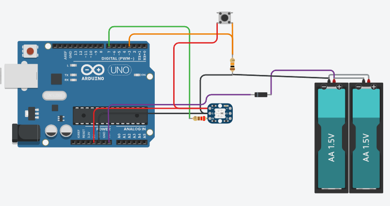
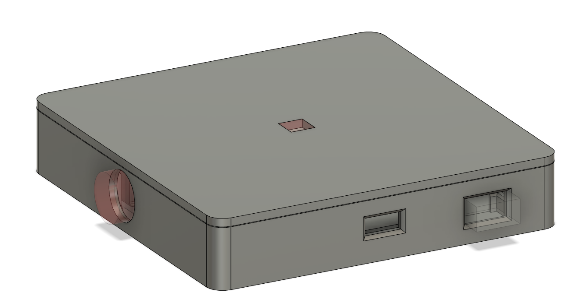
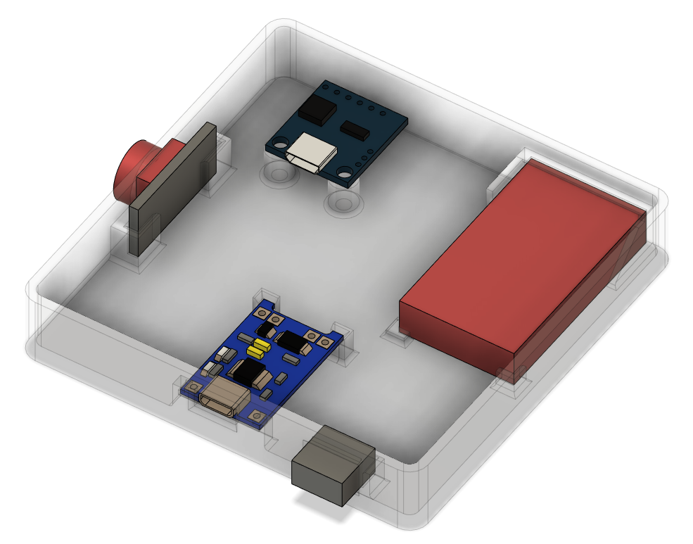

# Bottle-LED
ATTINY-85 driven RGB LED for Bottle Lamps

# Hardware

* Digispark ATTINY-85 Board
* WS2812b single LED Strip (+ 1kOhm Resistor for Data Pin)
* Tactile Button (+ 10kOhm Pulldown Resistor)
* TP4056 Li-Ion Battery Charger
* Li-Ion Battery (3.7v, 600mAh)

# Code
* Toggle through Colors and Animations by pressing Button
* FastLED Library to control WS2812b LED
* EEPROM to permanently store Color set by User

# 3D Case

